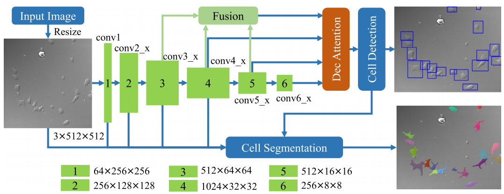

# ANCIS-Pytorch
[Attentive Neural Cell Instance Segmentation](https://www.sciencedirect.com/science/article/pii/S1361841518308442)

Please cite the article in your publications if it helps your research:

	@article{YI2019228,
		title = "Attentive neural cell instance segmentation",
		journal = "Medical Image Analysis",
		volume = "55",
		pages = "228 - 240",
		year = "2019",
		issn = "1361-8415",
		doi = "https://doi.org/10.1016/j.media.2019.05.004",
		url = "http://www.sciencedirect.com/science/article/pii/S1361841518308442",
		author = "Jingru Yi and Pengxiang Wu and Menglin Jiang and Qiaoying Huang and Daniel J. Hoeppner and Dimitris N. Metaxas"
	}

# Introduction
Neural cell instance segmentation, which aims at joint detection and segmentation of every neural cell in a microscopic image, is essential to many neuroscience applications. The challenge of this task involves cell adhesion, cell distortion, unclear cell contours, low-contrast cell protrusion structures, and background impurities. Consequently, current instance segmentation methods generally fall short of precision. In this paper, we propose an attentive instance segmentation method that accurately predicts the bounding box of each cell as well as its segmentation mask simultaneously. In particular, our method builds on a joint network that combines a single shot multi-box detector (SSD) and a U-net. Furthermore, we employ the attention mechanism in both detection and segmentation modules to focus the model on the useful features. The proposed method is validated on a dataset of neural cell microscopic images. Experimental results demonstrate that our approach can accurately detect and segment neural cell instances at a fast speed, comparing favorably with the state-of-the-art methods.

	

## Dependencies
Library: opencv-python, PyTorch>0.4.0, Ubuntu 14.04

## Implementation Details
To accelerate the training process, we trained the detection and segmentation modules separately.  In particular, the weights of the detection module are frozen when training the segmentation module.
